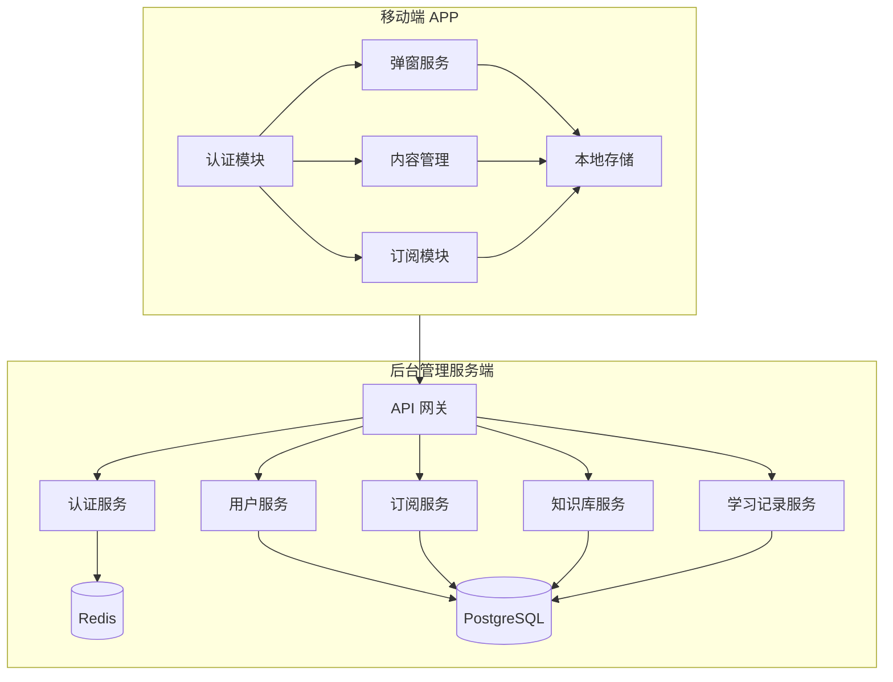
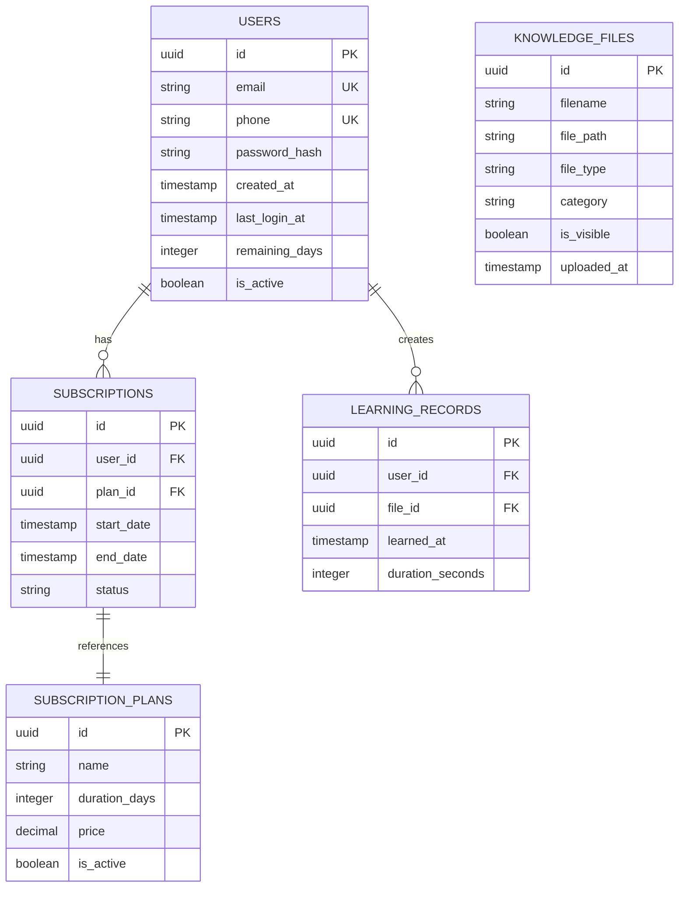
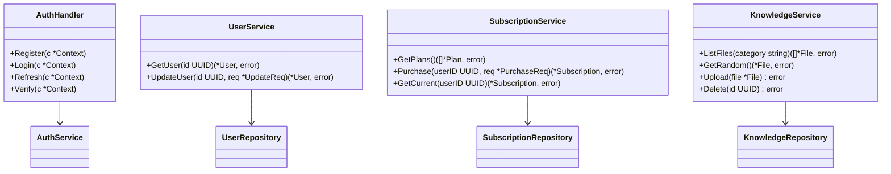
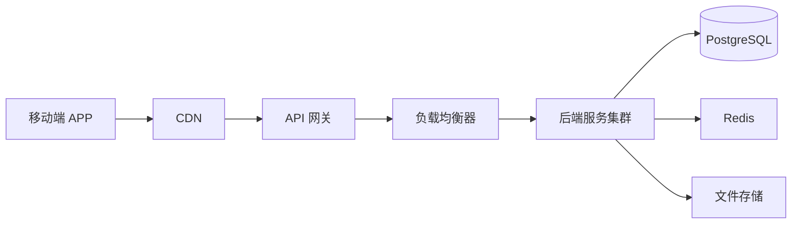

# 强制学习系统 - 技术设计方案

需求名称：2026-03-23-force-learning-system
更新日期：2026-03-23

## 1. 概述

### 1.1 项目背景

"强制学习"系统是一个帮助用户通过定时弹窗方式进行强制性学习的工具，包含后台管理服务端和移动端应用（Android/iOS）。

### 1.2 核心功能

| 功能模块 | 描述 |
|---------|------|
| 认证模块 | 用户注册、登录、JWT 认证 |
| 订阅模块 | 套餐管理、订阅购买、到期提醒 |
| 知识库模块 | 知识文件管理、随机内容获取 |
| 弹窗学习模块 | 强制弹窗、计时锁定、学习记录 |
| 后台管理 | 用户管理、内容管理、系统配置 |

### 1.3 技术目标

- 提供稳定的 RESTful API 服务
- 实现跨平台移动端支持（Android/iOS）
- 确保数据安全和通信安全
- 支持高并发访问

## 2. 架构设计

### 2.1 系统架构图



### 2.2 后端架构

```
backend/
├── cmd/
│   └── server/           # 入口程序
├── internal/
│   ├── api/              # API 层
│   │   ├── handler/       # HTTP Handler
│   │   ├── middleware/    # 中间件
│   │   └── router/        # 路由定义
│   ├── service/           # 业务逻辑层
│   ├── repository/       # 数据访问层
│   ├── model/             # 数据模型
│   └── pkg/               # 内部工具包
├── configs/              # 配置文件
├── scripts/              # 部署脚本
└── go.mod
```

### 2.3 移动端架构

```
lib/
├── core/                  # 核心模块
│   ├── api/               # API 客户端 (Dio)
│   ├── storage/           # 本地存储 (SQLite/Room)
│   └── security/          # 安全相关 (JWT, 加密)
├── features/              # 功能模块
│   ├── auth/              # 认证模块
│   ├── learning/          # 学习模块
│   ├── subscription/      # 订阅模块
│   └── settings/          # 设置模块
├── services/              # 服务层
│   ├── auth_service.dart
│   ├── learning_service.dart
│   └── popup_service.dart
└── shared/                # 共享组件
```

## 3. 技术选型

### 3.1 后端技术栈

| 组件 | 推荐方案 | 备选方案 |
|------|---------|---------|
| 运行时 | Go 1.21+ | Node.js 18+ |
| 框架 | Gin | Echo/Fiber |
| 数据库 | PostgreSQL 15 | MySQL 8.0 |
| 缓存 | Redis 7 | - |
| ORM | GORM | sqlx |
| 认证 | JWT | - |
| 文件存储 | 本地存储 | MinIO |

### 3.2 移动端技术栈

| 组件 | 推荐方案 | 备选方案 |
|------|---------|---------|
| 跨平台框架 | Flutter 3.x | React Native |
| 状态管理 | Riverpod | Provider |
| HTTP 客户端 | Dio | - |
| 本地数据库 | Drift (SQLite) | SharedPreferences |
| 弹窗实现 | flutter_overlay | - |

### 3.3 技术决策点确认

| 决策点 | 推荐方案 | 需要确认 |
|--------|---------|---------|
| 后端语言 | Go | 待确认 |
| 移动端方案 | Flutter | 待确认 |
| 数据库 | PostgreSQL | 待确认 |
| 支付集成 | Stripe | 待确认 |

## 4. 数据模型

### 4.1 ER 图



### 4.2 表结构

#### users 表
| 字段 | 类型 | 约束 | 说明 |
|------|------|------|------|
| id | UUID | PK | 用户 ID |
| email | VARCHAR(255) | UNIQUE | 邮箱 |
| phone | VARCHAR(20) | UNIQUE | 手机号 |
| password_hash | VARCHAR(255) | NOT NULL | 密码哈希 |
| created_at | TIMESTAMP | DEFAULT NOW() | 创建时间 |
| last_login_at | TIMESTAMP | | 最后登录时间 |
| remaining_days | INTEGER | DEFAULT 3 | 剩余学习天数 |
| is_active | BOOLEAN | DEFAULT true | 账户状态 |

#### subscriptions 表
| 字段 | 类型 | 约束 | 说明 |
|------|------|------|------|
| id | UUID | PK | 订阅 ID |
| user_id | UUID | FK → users | 用户 ID |
| plan_id | UUID | FK → subscription_plans | 套餐 ID |
| start_date | TIMESTAMP | NOT NULL | 开始日期 |
| end_date | TIMESTAMP | NOT NULL | 结束日期 |
| status | VARCHAR(20) | DEFAULT 'active' | 状态 |

#### knowledge_files 表
| 字段 | 类型 | 约束 | 说明 |
|------|------|------|------|
| id | UUID | PK | 文件 ID |
| filename | VARCHAR(255) | NOT NULL | 文件名 |
| file_path | VARCHAR(512) | NOT NULL | 存储路径 |
| file_type | VARCHAR(10) | NOT NULL | 文件类型 |
| category | VARCHAR(100) | | 分类 |
| is_visible | BOOLEAN | DEFAULT true | 是否可见 |
| uploaded_at | TIMESTAMP | DEFAULT NOW() | 上传时间 |

#### learning_records 表
| 字段 | 类型 | 约束 | 说明 |
|------|------|------|------|
| id | UUID | PK | 记录 ID |
| user_id | UUID | FK → users | 用户 ID |
| file_id | UUID | FK → knowledge_files | 文件 ID |
| learned_at | TIMESTAMP | | 学习时间 |
| duration_seconds | INTEGER | | 学习时长(秒) |

## 5. API 接口设计

### 5.1 API 分组

| 分组 | 前缀 | 说明 |
|------|------|------|
| 认证 | `/api/v1/auth` | 用户注册、登录、凭证验证 |
| 用户 | `/api/v1/users` | 用户信息管理 |
| 订阅 | `/api/v1/subscriptions` | 订阅管理 |
| 知识库 | `/api/v1/knowledge` | 知识库文件管理 |
| 学习记录 | `/api/v1/learning` | 学习记录同步 |

### 5.2 认证 API

| 方法 | 路径 | 说明 | 认证 |
|------|------|------|------|
| POST | `/api/v1/auth/register` | 用户注册 | 否 |
| POST | `/api/v1/auth/login` | 用户登录 | 否 |
| POST | `/api/v1/auth/refresh` | 刷新 Token | 是 |
| POST | `/api/v1/auth/verify` | 验证 Token | 是 |
| GET | `/api/v1/auth/status` | 获取用户状态 | 是 |

### 5.3 订阅 API

| 方法 | 路径 | 说明 | 认证 |
|------|------|------|------|
| GET | `/api/v1/subscriptions/plans` | 获取套餐列表 | 否 |
| POST | `/api/v1/subscriptions/purchase` | 购买订阅 | 是 |
| GET | `/api/v1/subscriptions/current` | 获取当前订阅 | 是 |

### 5.4 知识库 API

| 方法 | 路径 | 说明 | 认证 |
|------|------|------|------|
| GET | `/api/v1/knowledge/files` | 获取文件列表 | 是 |
| GET | `/api/v1/knowledge/random` | 获取随机内容 | 是 |
| GET | `/api/v1/knowledge/download/:id` | 下载文件 | 是 |
| POST | `/api/v1/knowledge/upload` | 上传文件 | 是(Admin) |
| DELETE | `/api/v1/knowledge/files/:id` | 删除文件 | 是(Admin) |

### 5.5 统一响应格式

成功响应：
```json
{
    "code": 200,
    "message": "success",
    "data": {}
}
```

错误响应：
```json
{
    "code": 400,
    "message": "error description",
    "data": null
}
```

## 6. 组件与接口

### 6.1 后端组件



### 6.2 移动端组件

| 组件 | 职责 |
|------|------|
| ApiClient | HTTP 请求封装、Token 管理、自动重试 |
| AuthRepository | 认证数据管理、登录状态维护 |
| LearningRepository | 学习内容本地缓存、学习记录同步 |
| PopupService | 弹窗显示逻辑、计时控制 |
| SyncService | 后台数据同步、冲突处理 |

## 7. 正确性属性

### 7.1 功能正确性

- 用户必须通过有效凭证（邮箱/手机 + 密码）注册和登录
- 订阅到期后，弹窗功能自动禁用，需续费后才能继续
- 学习记录必须准确记录学习时长和内容
- 知识库文件仅对订阅用户可见

### 7.2 数据一致性

- 用户剩余天数在订阅购买/到期时正确扣减/恢复
- 学习记录的 learned_at 时间以服务端时间为准
- 并发情况下订阅状态更新使用数据库事务

### 7.3 安全性

| 安全措施 | 实现方式 |
|---------|---------|
| 密码存储 | bcrypt 强哈希 |
| 传输安全 | HTTPS TLS 1.3 |
| 认证机制 | JWT Access Token (15min) + Refresh Token (7d) |
| 本地敏感数据 | AES-256 加密存储 |
| API 防护 | 限流 (100req/min)、签名验证 |

## 8. 错误处理

### 8.1 错误码定义

| 错误码 | 说明 |
|--------|------|
| 400 | 请求参数错误 |
| 401 | 未认证或 Token 过期 |
| 403 | 无权限访问 |
| 404 | 资源不存在 |
| 429 | 请求过于频繁 |
| 500 | 服务器内部错误 |

### 8.2 错误处理策略

```
API 错误响应流程:
1. 业务逻辑层验证失败 → 返回业务错误码
2. 中间件拦截认证失败 → 401 Unauthorized
3. 数据库异常 → 500 + 日志记录
4. 未知异常 → 500 + 错误追踪 ID
```

### 8.3 移动端错误处理

| 场景 | 处理策略 |
|------|---------|
| 网络断开 | 本地缓存 + 离线模式 + 网络恢复后同步 |
| Token 过期 | 自动刷新 Token，失败则跳转登录 |
| API 429 | 指数退避重试 |
| 服务不可用 | 提示用户并记录错误日志 |

## 9. 测试策略

### 9.1 后端测试

| 测试类型 | 覆盖范围 | 工具 |
|---------|---------|------|
| 单元测试 | Service 层业务逻辑 | go testing |
| 集成测试 | Repository + Database | go testing + testcontainers |
| API 测试 | Handler 层 | httptest |
| 基准测试 | 关键路径性能 | go testing -bench |

### 9.2 移动端测试

| 测试类型 | 覆盖范围 | 工具 |
|---------|---------|------|
| 单元测试 | Repository、Service 层 | flutter_test |
| Widget 测试 | UI 组件 | flutter_test |
| 集成测试 | 完整业务流程 | integration_test |
| 端到端测试 | 用户操作流程 | Patrol/Cheatfreeze |

### 9.3 测试覆盖率要求

- 核心业务逻辑覆盖率 > 80%
- API endpoint 覆盖率 > 90%
- 移动端关键功能覆盖率 > 70%

## 10. 部署架构



### 10.1 基础设施

| 组件 | 规格 | 说明 |
|------|------|------|
| API 服务器 | 2核4G × 3 | 弹性伸缩 |
| 数据库 | 4核8G | 主从复制 |
| Redis | 2核4G | 集群模式 |
| 文件存储 | 对象存储 | 容量按需扩展 |

## 11. 待确认事项

请确认以下技术决策：

1. **后端语言**：Go (推荐) vs Node.js
2. **移动端框架**：Flutter (推荐) vs React Native vs 原生开发
3. **数据库**：PostgreSQL (推荐) vs MySQL
4. **支付集成**：Stripe (推荐) vs 支付宝/微信支付

如有其他偏好或约束条件，请一并告知。
