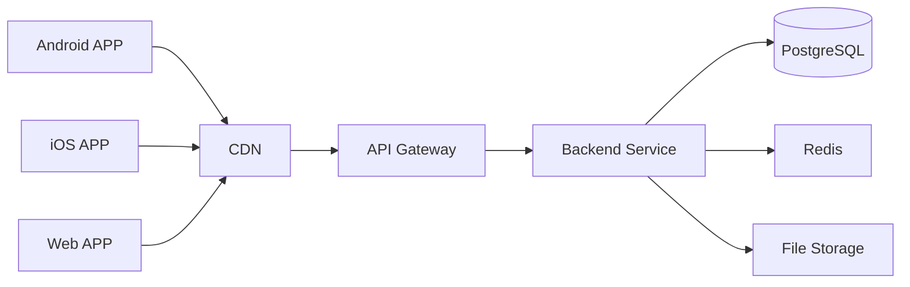

# Force Learning API 文档

基于 `2026-03-23-force-learning-system` 设计方案

## 基础信息

| 项目 | 值 |
|------|-----|
| 基础 URL | `http://{host}/api/v1` |
| 认证方式 | Bearer Token (JWT) |
| 响应格式 | JSON |
| 字符编码 | UTF-8 |

### 统一响应格式

**成功响应：**
```json
{
  "code": 200,
  "message": "success",
  "data": {}
}
```

**错误响应：**
```json
{
  "code": 400,
  "message": "error description",
  "data": null
}
```

### 错误码定义

| 错误码 | 说明 |
|--------|------|
| 200 | 成功 |
| 201 | 创建成功 |
| 400 | 请求参数错误 |
| 401 | 未认证或 Token 过期 |
| 403 | 无权限访问 |
| 404 | 资源不存在 |
| 429 | 请求过于频繁 |
| 500 | 服务器内部错误 |

---

## 认证 API

### 用户注册

**POST** `/auth/register`

注册新用户账户。

**请求参数：**
```json
{
  "email": "user@example.com",
  "phone": null,
  "password": "password123"
}
```

| 参数 | 类型 | 必填 | 说明 |
|------|------|------|------|
| email | string | 否 | 邮箱地址（与 phone 二选一） |
| phone | string | 否 | 手机号（与 email 二选一） |
| password | string | 是 | 密码（至少 6 位） |

**成功响应 (201)：**
```json
{
  "code": 201,
  "message": "success",
  "data": {
    "access_token": "eyJhbGciOiJIUzI1NiIs...",
    "refresh_token": "eyJhbGciOiJIUzI1NiIs...",
    "expires_in": 900
  }
}
```

---

### 用户登录

**POST** `/auth/login`

用户登录获取 Token。

**请求参数：**
```json
{
  "email": "user@example.com",
  "phone": null,
  "password": "password123"
}
```

**成功响应 (200)：**
```json
{
  "code": 200,
  "message": "success",
  "data": {
    "access_token": "eyJhbGciOiJIUzI1NiIs...",
    "refresh_token": "eyJhbGciOiJIUzI1NiIs...",
    "expires_in": 900
  }
}
```

---

### 刷新 Token

**POST** `/auth/refresh`

使用 Refresh Token 获取新的 Access Token。

**请求参数：**
```json
{
  "refresh_token": "eyJhbGciOiJIUzI1NiIs..."
}
```

**成功响应 (200)：**
```json
{
  "code": 200,
  "message": "success",
  "data": {
    "access_token": "eyJhbGciOiJIUzI1NiIs...",
    "refresh_token": "eyJhbGciOiJIUzI1NiIs...",
    "expires_in": 900
  }
}
```

---

### 验证 Token

**POST** `/auth/verify`

验证 Access Token 是否有效。

**请求头：**
```
Authorization: Bearer {access_token}
```

**成功响应 (200)：**
```json
{
  "code": 200,
  "message": "success",
  "data": {
    "user_id": "uuid-string"
  }
}
```

---

### 获取用户状态

**GET** `/auth/status`

获取当前登录用户的状态信息。

**请求头：**
```
Authorization: Bearer {access_token}
```

**成功响应 (200)：**
```json
{
  "code": 200,
  "message": "success",
  "data": {
    "id": "uuid-string",
    "email": "user@example.com",
    "phone": null,
    "remaining_days": 30,
    "is_active": true,
    "has_subscription": true
  }
}
```

---

## 订阅 API

### 获取套餐列表

**GET** `/subscriptions/plans`

获取所有可用的订阅套餐。

**认证：** 否

**成功响应 (200)：**
```json
{
  "code": 200,
  "message": "success",
  "data": [
    {
      "id": "uuid-string",
      "name": "月度订阅",
      "duration_days": 30,
      "price": 29.9,
      "is_active": true
    },
    {
      "id": "uuid-string",
      "name": "季度订阅",
      "duration_days": 90,
      "price": 79.9,
      "is_active": true
    },
    {
      "id": "uuid-string",
      "name": "年度订阅",
      "duration_days": 365,
      "price": 299.9,
      "is_active": true
    }
  ]
}
```

---

### 购买订阅（直接）

**POST** `/subscriptions/purchase`

直接购买订阅（无需支付流程）。

**请求头：**
```
Authorization: Bearer {access_token}
```

**请求参数：**
```json
{
  "plan_id": "uuid-string"
}
```

**成功响应 (201)：**
```json
{
  "code": 201,
  "message": "success",
  "data": {
    "id": "uuid-string",
    "user_id": "uuid-string",
    "plan_id": "uuid-string",
    "start_date": "2026-03-23T10:00:00Z",
    "end_date": "2026-04-22T10:00:00Z",
    "status": "active"
  }
}
```

---

### 创建支付订单

**POST** `/subscriptions/create-payment`

创建支付订单（支付宝/微信）。

**请求头：**
```
Authorization: Bearer {access_token}
```

**请求参数：**
```json
{
  "plan_id": "uuid-string",
  "payment_method": "alipay"
}
```

| 参数 | 类型 | 必填 | 说明 |
|------|------|------|------|
| plan_id | string | 是 | 套餐 ID |
| payment_method | string | 是 | 支付方式：`alipay` 或 `wxpay` |

**成功响应 (200)：**
```json
{
  "code": 200,
  "message": "success",
  "data": {
    "success": true,
    "order_id": "17091234567890123456",
    "payment_url": "https://openapi.alipay.com/gateway.do?...",
    "payment_data": {}
  }
}
```

---

### 获取当前订阅

**GET** `/subscriptions/current`

获取用户当前的活跃订阅。

**请求头：**
```
Authorization: Bearer {access_token}
```

**成功响应 (200)：**
```json
{
  "code": 200,
  "message": "success",
  "data": {
    "id": "uuid-string",
    "user_id": "uuid-string",
    "plan_id": "uuid-string",
    "start_date": "2026-03-23T10:00:00Z",
    "end_date": "2026-04-22T10:00:00Z",
    "status": "active"
  }
}
```

---

## 支付回调 API

### 支付宝回调

**POST** `/alipay/callback`

接收支付宝支付结果通知。

**请求参数 (Query)：**
| 参数 | 说明 |
|------|------|
| trade_status | 交易状态 (TRADE_SUCCESS) |
| out_trade_no | 商户订单号 |
| trade_no | 支付宝交易号 |
| total_amount | 订单金额 |
| sign | 签名 |

**响应：** `success` 或 `fail`

---

### 微信支付回调

**POST** `/wxpay/callback`

接收微信支付结果通知。

**请求参数 (Query)：**
| 参数 | 说明 |
|------|------|
| trade_state | 交易状态 (SUCCESS) |
| out_trade_no | 商户订单号 |
| transaction_id | 微信交易号 |
| total_fee | 订单金额（分） |
| sign | 签名 |

**响应：** `success` 或 `fail`

---

## 知识库 API

### 获取文件列表

**GET** `/knowledge/files`

获取知识库文件列表。

**请求头：**
```
Authorization: Bearer {access_token}
```

**查询参数：**
| 参数 | 类型 | 必填 | 说明 |
|------|------|------|------|
| category | string | 否 | 分类筛选 |

**成功响应 (200)：**
```json
{
  "code": 200,
  "message": "success",
  "data": [
    {
      "id": "uuid-string",
      "filename": "数学公式.md",
      "file_path": "/uploads/files/uuid.md",
      "file_type": "md",
      "category": "数学",
      "is_visible": true,
      "uploaded_at": "2026-03-23T10:00:00Z"
    }
  ]
}
```

---

### 获取随机内容

**GET** `/knowledge/random`

随机获取一个知识文件。

**请求头：**
```
Authorization: Bearer {access_token}
```

**成功响应 (200)：**
```json
{
  "code": 200,
  "message": "success",
  "data": {
    "id": "uuid-string",
    "filename": "英语词汇.md",
    "file_path": "/uploads/files/uuid.md",
    "file_type": "md",
    "category": "英语",
    "is_visible": true,
    "uploaded_at": "2026-03-23T10:00:00Z"
  }
}
```

---

### 下载文件

**GET** `/knowledge/download/:id`

下载指定的知识文件。

**请求头：**
```
Authorization: Bearer {access_token}
```

**路径参数：**
| 参数 | 说明 |
|------|------|
| id | 文件 ID |

**成功响应：** 文件二进制流

---

### 上传文件

**POST** `/knowledge/upload`

上传新的知识文件（仅管理员）。

**请求头：**
```
Authorization: Bearer {access_token}
X-Admin-Token: {admin_token}
Content-Type: multipart/form-data
```

**表单参数：**
| 参数 | 类型 | 必填 | 说明 |
|------|------|------|------|
| file | file | 是 | 文件 |
| category | string | 否 | 分类 |

**成功响应 (201)：**
```json
{
  "code": 201,
  "message": "success",
  "data": {
    "id": "uuid-string",
    "filename": "new-file.md",
    "file_path": "/uploads/files/uuid.md",
    "file_type": "md",
    "category": "数学",
    "is_visible": true,
    "uploaded_at": "2026-03-23T10:00:00Z"
  }
}
```

---

### 删除文件

**DELETE** `/knowledge/files/:id`

删除指定的知识文件（仅管理员）。

**请求头：**
```
Authorization: Bearer {access_token}
X-Admin-Token: {admin_token}
```

**路径参数：**
| 参数 | 说明 |
|------|------|
| id | 文件 ID |

**成功响应 (200)：**
```json
{
  "code": 200,
  "message": "success",
  "data": null
}
```

---

## 学习记录 API

### 创建学习记录

**POST** `/learning/records`

创建一条学习记录。

**请求头：**
```
Authorization: Bearer {access_token}
```

**请求参数：**
```json
{
  "file_id": "uuid-string",
  "duration_seconds": 1800,
  "client_id": "optional-client-uuid"
}
```

| 参数 | 类型 | 必填 | 说明 |
|------|------|------|------|
| file_id | string | 是 | 知识文件 ID |
| duration_seconds | int | 是 | 学习时长（秒） |
| client_id | string | 否 | 客户端 ID（用于离线同步去重） |

**成功响应 (201)：**
```json
{
  "code": 201,
  "message": "success",
  "data": {
    "id": "uuid-string",
    "user_id": "uuid-string",
    "file_id": "uuid-string",
    "learned_at": "2026-03-23T10:00:00Z",
    "duration_seconds": 1800
  }
}
```

---

### 获取学习记录

**GET** `/learning/records`

获取用户的学习记录列表。

**请求头：**
```
Authorization: Bearer {access_token}
```

**查询参数：**
| 参数 | 类型 | 必填 | 说明 |
|------|------|------|------|
| date | string | 否 | 日期筛选 (YYYY-MM-DD) |

**成功响应 (200)：**
```json
{
  "code": 200,
  "message": "success",
  "data": [
    {
      "id": "uuid-string",
      "user_id": "uuid-string",
      "file_id": "uuid-string",
      "learned_at": "2026-03-23T10:00:00Z",
      "duration_seconds": 1800
    }
  ]
}
```

---

### 获取学习统计

**GET** `/learning/statistics`

获取用户的学习统计数据。

**请求头：**
```
Authorization: Bearer {access_token}
```

**成功响应 (200)：**
```json
{
  "code": 200,
  "message": "success",
  "data": {
    "total_duration_seconds": 36000,
    "total_duration_formatted": "10:00:00"
  }
}
```

---

### 批量创建学习记录

**POST** `/learning/records/batch`

批量创建学习记录（用于离线数据同步）。

**请求头：**
```
Authorization: Bearer {access_token}
```

**请求参数：**
```json
{
  "records": [
    {
      "file_id": "uuid-string",
      "duration_seconds": 1800,
      "learned_at": "2026-03-23T10:00:00Z",
      "client_id": "client-uuid-1"
    },
    {
      "file_id": "uuid-string",
      "duration_seconds": 900,
      "learned_at": "2026-03-23T11:00:00Z",
      "client_id": "client-uuid-2"
    }
  ]
}
```

**成功响应 (201)：**
```json
{
  "code": 201,
  "message": "success",
  "data": {
    "created": 2
  }
}
```

---

### 同步学习记录

**POST** `/learning/sync`

同步客户端学习记录（支持去重）。

**请求头：**
```
Authorization: Bearer {access_token}
```

**请求参数：**
```json
{
  "last_sync_time": "2026-03-23T08:00:00Z",
  "records": [
    {
      "client_id": "client-uuid-1",
      "file_id": "uuid-string",
      "duration_seconds": 1800,
      "learned_at": "2026-03-23T10:00:00Z"
    }
  ]
}
```

**成功响应 (200)：**
```json
{
  "code": 200,
  "message": "success",
  "data": {
    "synced_records": [
      {
        "client_id": "client-uuid-1",
        "server_id": "uuid-string",
        "synced": true,
        "learned_at": "2026-03-23T10:00:00Z"
      }
    ],
    "server_time": "2026-03-23T12:00:00Z",
    "has_more": false
  }
}
```

---

### 获取未同步记录

**GET** `/learning/unsynced`

获取服务器上有但客户端没有的学习记录。

**请求头：**
```
Authorization: Bearer {access_token}
```

**查询参数：**
| 参数 | 类型 | 必填 | 说明 |
|------|------|------|------|
| since | string | 否 | 获取指定时间后的记录 (RFC3339) |

**成功响应 (200)：**
```json
{
  "code": 200,
  "message": "success",
  "data": [
    {
      "id": "uuid-string",
      "user_id": "uuid-string",
      "file_id": "uuid-string",
      "learned_at": "2026-03-23T10:00:00Z",
      "duration_seconds": 1800
    }
  ]
}
```

---

## 管理员 API

### 管理员认证中间件

部分接口需要管理员权限，需要在请求头中添加：

```
X-Admin-Token: {admin_token}
```

### 管理员专属接口

| 方法 | 路径 | 说明 |
|------|------|------|
| POST | `/knowledge/upload` | 上传知识文件 |
| DELETE | `/knowledge/files/:id` | 删除知识文件 |

---

## 环境变量

### 后端服务环境变量

| 变量名 | 默认值 | 说明 |
|--------|--------|------|
| SERVER_PORT | 8080 | 服务端口 |
| DB_HOST | localhost | PostgreSQL 主机 |
| DB_PORT | 5432 | PostgreSQL 端口 |
| DB_USER | postgres | 数据库用户 |
| DB_PASSWORD | postgres | 数据库密码 |
| DB_NAME | force_learning | 数据库名 |
| REDIS_HOST | localhost | Redis 主机 |
| REDIS_PORT | 6379 | Redis 端口 |
| JWT_SECRET | - | JWT 密钥（必须设置） |
| UPLOAD_PATH | ./uploads | 文件上传路径 |
| ALIPAY_APP_ID | - | 支付宝 App ID |
| ALIPAY_PRIVATE_KEY | - | 支付宝私钥 |
| ALIPAY_PUBLIC_KEY | - | 支付宝公钥 |
| ALIPAY_NOTIFY_URL | - | 支付宝回调地址 |
| WXPAY_APP_ID | - | 微信支付 App ID |
| WXPAY_MCH_ID | - | 微信支付商户号 |
| WXPAY_API_KEY | - | 微信支付 API 密钥 |
| WXPAY_NOTIFY_URL | - | 微信支付回调地址 |

---

## 部署架构


